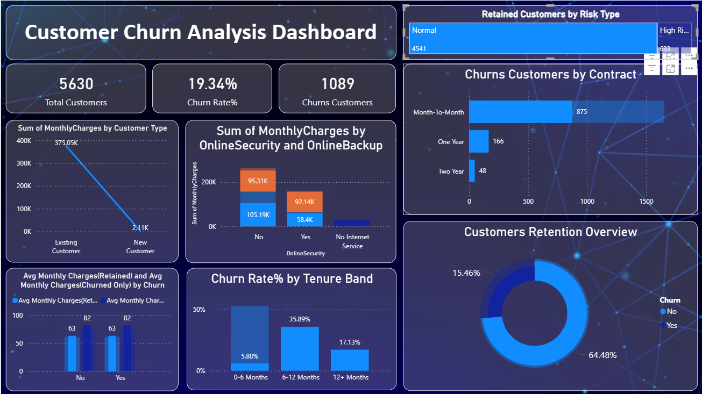

# FUTURE_DS_02
## Customer Churn Analysis Dashboard

An end-to-end customer retention and churn analysis project built in Power BI, using the Telco Customer Churn dataset. The project covers the full pipeline: data cleaning → DAX modeling → interactive dashboard → business recommendations.

## Dashboard Preview

## Dashboard Preview

## 📌 Problem Statement

Out of 5,630 customers, 19.34% had churned. The goal was to move beyond that single number and identify which customers churn, when they churn, and why — then turn that into recommendations a founder or product manager could act on.

## 🧰 Tools Used

Power BI — dashboard design, DAX measures, interactive visuals
Power Query — data cleaning and transformation
DAX — Churn Rate, Retained/Churned segmentation, Risk Type flagging

## 🧹 Data Preparation

Loaded raw CSV into Power BI and cleaned via Power Query
Replaced missing TotalCharges values with zero
Fixed currency formatting and corrected data types (Decimal vs. Text)
Resolved inconsistent phone/internet service flags using conditional columns
Removed duplicate Customer IDs

## 📐 Key DAX Measures

Total Customers — distinct count of Customer IDs
Churned / Retained Customers — CALCULATE + FILTER on churn status
Churn Rate % — Churned Customers ÷ Total Customers
Tenure Band — calculated column grouping customers into 0–6, 6–12, 12+ months
Customer Type — New vs. Existing customer segmentation
Risk Type — flags "High Risk" customers (short tenure + month-to-month contract)

## 📊 Dashboard Highlights

MMetric                                        Value
Total Customers                                5,630
Churn Rate                                     19.34%
Churned Customers                              1,089
High-Risk Customers                            633
Highest-Risk Tenure Band                       6–12 months (35.89% churn)
Highest-Risk Contract Type                     Month-to-Month (875 churned)

## 💡 Key Insights

Churn peaks at the 6–12 month mark (35.89%), not at signup — the danger zone is mid-first-year, not day one.
Month-to-month contracts drive 80%+ of all churn, while two-year contracts retain almost everyone (48 churned vs. 875).
Price is not the primary churn driver — average monthly charges are nearly identical for retained and churned customers.
Unprotected accounts (no Online Security/Backup) carry the highest billing exposure, making them a high-value segment to defend.

## ✅ Recommendations

Trigger proactive retention outreach at month 5–6, before customers enter the highest-risk window.
Incentivize month-to-month customers to upgrade to annual contracts once tenure and usage stabilize.
Bundle Online Security/Backup by default rather than as opt-in add-ons.
Operationalize the "High Risk" flag as a recurring, actionable watchlist for customer success teams.
Shift retention budget away from blanket discounting toward contract-term and onboarding interventions.

## 📁 Files in This Repo

Customer_Churn_Analysis_Dashboard.pbix — full Power BI file
Dashboard2.png — dashboard screenshot
Churn_Analysis_Insights_Report.docx — full written insights & recommendations report
README.md — this file

## 🔗 Project Context

Built as part of the Future Interns Data Analytics track, using the Telco Customer Churn dataset from Kaggle.
Dataset Link : https://www.kaggle.com/datasets/blastchar/telco-customer-churn
## Results & Conclusion
The analysis revealed that contract type, tenure, and monthly charges are the strongest indicators of customer churn. By focusing retention efforts on high-risk customers and encouraging long-term subscriptions, businesses can significantly reduce churn and improve customer lifetime value.

## Future Work
Predictive churn modeling using Machine Learning
Customer Lifetime Value (CLV) prediction
Advanced cohort retention analysis
Automated retention alerts
Real-time dashboard integration

## Author
Ambikesh Chaurasia
GitHub: [Your GitHub Profile]
LinkedIn: [Your LinkedIn Profile]
